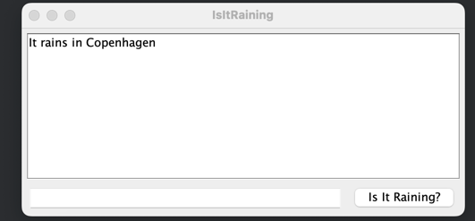

# API project, Java

As i am learning Java in my CS studies, I wanted to learn how to impliment a API i a console app with Java. The idea was to create a simple app, that takes the input city, checks it up against a API, in this case via AccuWeather and returns if its raining or not. It was a awesome learning experience. 
## Built With

- Java
- AccuWeather API

#### Pull request
Pull requests are always welcome, and I'll do my best to do
reviews as fast as I can.
## License
This project is licensed under the [MIT
License](https://github.com/this/project/blob/master/LICENSE)
